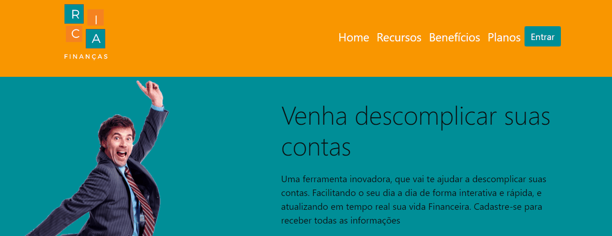
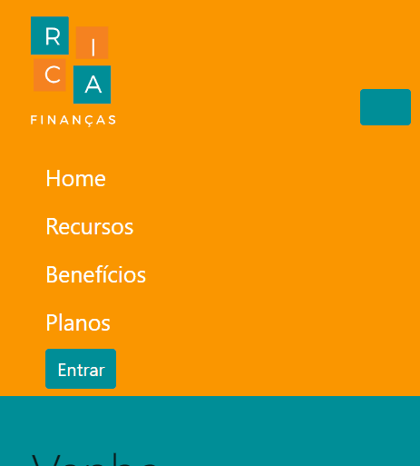

# Projeto Financeiro para portifólio

Um site responsivo para quem quer, organizar suas contas mensalmente. É apenas um site fictício, que foi feito para eu colocar no portifólio e mostrar meus conheceimentos.

        

## Funcionalidades

🗸 Tema mantido na página inteira  
🗸 Botão fictício de cadastro  
🗸 Menu que leva aos tópicos de cada página 
🗸 Site responsivo 

## Linguagens utilizadas no projeto
* Html
* CSS
* Bootstrap

## Autor(a)

| Rayra de Sousa  
| rayratanisiadigital@gmail.com 
| [Meu Linkedin](https://www.linkedin.com/in/rayra-tanisia-sousa-624578204/)

Este foi meu primeiro projeto feito, para colocar no portifólio e mostrar um pouco das linguagens de tecnologia que estou aprendendo.❤️🚧
